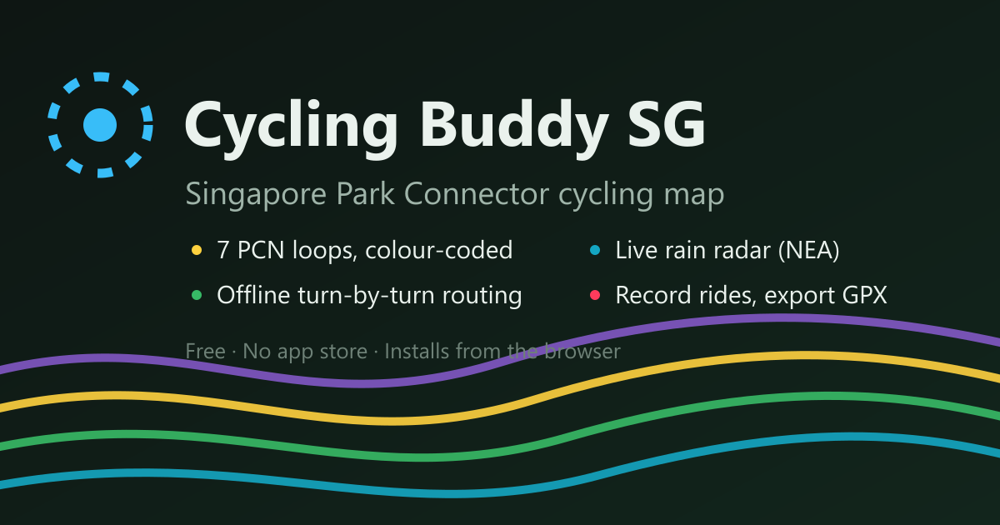

# Cycling Buddy SG — the free cycling map for Singapore

**Free for everyone:** https://jiaenlin.github.io/cycling-buddy-sg/

The whole of cycling Singapore on one installable, **offline-capable** map: the 7 Park Connector
(PCN) loops, LTA's cycling paths, the Rail Corridor, every park and nature reserve, and bike
parking island-wide. Plan routes offline, check the rain before you go, find your nearest
connector, record your ride — on a real street basemap. No app store, no sign-up, no ads, no
tracking cookies.

**In numbers:** 334.8 km of park connectors · 432.9 km of cycling paths · 24.2 km Rail Corridor ·
305 parks & nature reserves (64.7 km²) · 396 bike racks (19,329 spaces) · live NEA rain radar.



## Features
- **Map** — the 7 PCN loops (colour-coded), the Rail Corridor, LTA cycling paths, and every
  park & nature reserve on a light/dark street basemap.
- **Parks & reserves** — 305 green spaces (64.7 km²) washed in under the network; tap for name and size.
- **Bike parking** — LTA's 396 racks (19,329 spaces) from z13.5; solid **P** = sheltered, hollow = open-air.
  When you're located, the nearest rack shows in the panel — tap to jump to it.
- **Locate** — live GPS position and the nearest park connector.
- **Route** — offline turn-by-turn A* routing with a cycling cost profile that prefers
  cycleways/park connectors over roads over footpaths, and **excludes expressways**. Two options
  per trip (*Most cycling* / *Shorter*), colour-coded by segment, with a **helmet notice** when a route uses roads.
- **Weather** — live NEA 2-hour forecast: a rain-zone map of the island, plus a heads-up along your planned route.
- **Record** — trace a ride with live distance/time/speed, export **GPX**.
- **Installable PWA** — Add to Home Screen; works offline once loaded.
- **Private by design** — your location never leaves your device. No accounts, no tracking cookies.

## Why
Singapore's cycling network is scattered across separate agencies and datasets — NParks runs the
park connectors and parks, LTA the cycling paths and bike racks, NEA the weather. No free map put
them together and made them *routable, offline and rain-aware*. This app does.

## Run locally
Any static server over HTTP works (the service worker + geolocation need `localhost` or HTTPS):
```bash
python -m http.server 8000      # then open http://localhost:8000
```

## Data & attribution
- **Park connectors:** NParks *Park Connector Loop* (data.gov.sg, Singapore Open Data Licence).
- **Cycling paths:** LTA *Cycling Path Network* (data.gov.sg).
- **Parks & nature reserves:** NParks *Parks and Nature Reserves* (data.gov.sg). That dataset is a
  land inventory rather than a list of destinations, so the build drops its 136 neighbourhood
  playgrounds, 17 grass verges and 3 fitness corners, and gives the Botanic Gardens' four internal
  management zones their real name. See [`build/build_parks_racks.js`](build/build_parks_racks.js).
- **Bike parking:** LTA *Bicycle Rack* (data.gov.sg).
- **Weather:** NEA 2-hour forecast (data.gov.sg).
- **Routing graph, Rail Corridor & basemap:** © OpenStreetMap contributors (ODbL); basemap hosting by [OpenFreeMap](https://openfreemap.org).

## Development and release safety

Changes are gated by deterministic data/routing contracts, Chromium/Firefox/WebKit browser tests,
WCAG 2.2 AA automation, measured performance budgets, security checks, and a forward-versioned
service-worker recovery drill. Run `npm run verify:all` from a clean checkout for the complete
local suite.

Network data provenance and non-destructive rebuild instructions are in
[`docs/data/NETWORK_REPRODUCIBILITY.md`](docs/data/NETWORK_REPRODUCIBILITY.md). The versioned route
contracts and the no-fork path for a future native app or outdoor platform are described in
[`docs/architecture/PLATFORM_EVOLUTION.md`](docs/architecture/PLATFORM_EVOLUTION.md).

The routing graph (`data/graph.json`) is generated from OpenStreetMap — see [`build/`](build/).

## Tech
Vanilla JS, [MapLibre GL JS](https://maplibre.org/) (vendored, no CDN), a hand-rolled A* router
(`router.js`) over a contracted OSM graph. No build step, no framework, no backend — plain static files.

## Author & licence
Built by **[Lin Jiaen](https://github.com/JiaenLin)** · © 2026 Lin Jiaen · All rights reserved.

The **app is free to use and share**. The **source is published for transparency** but is not
open-licensed — see [LICENSE](LICENSE). Third-party data and libraries remain under their own
licences (ODbL, Singapore Open Data Licence, BSD-3).

Found a bug or have an idea? [Open an issue](https://github.com/JiaenLin/cycling-buddy-sg/issues) —
and if the app is useful to you, **star the repo** and share the link with your riding kakis. 🚴
